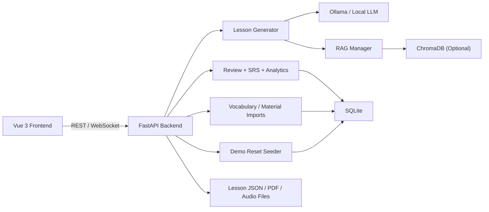
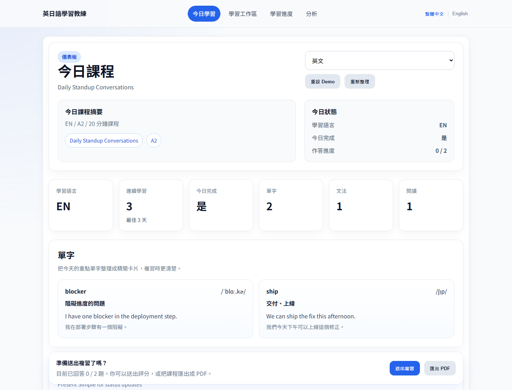
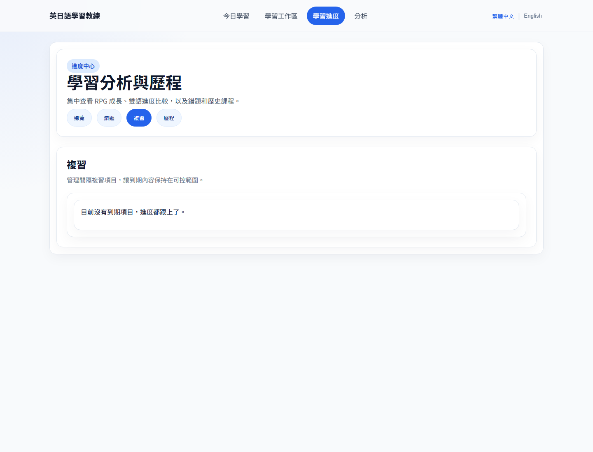
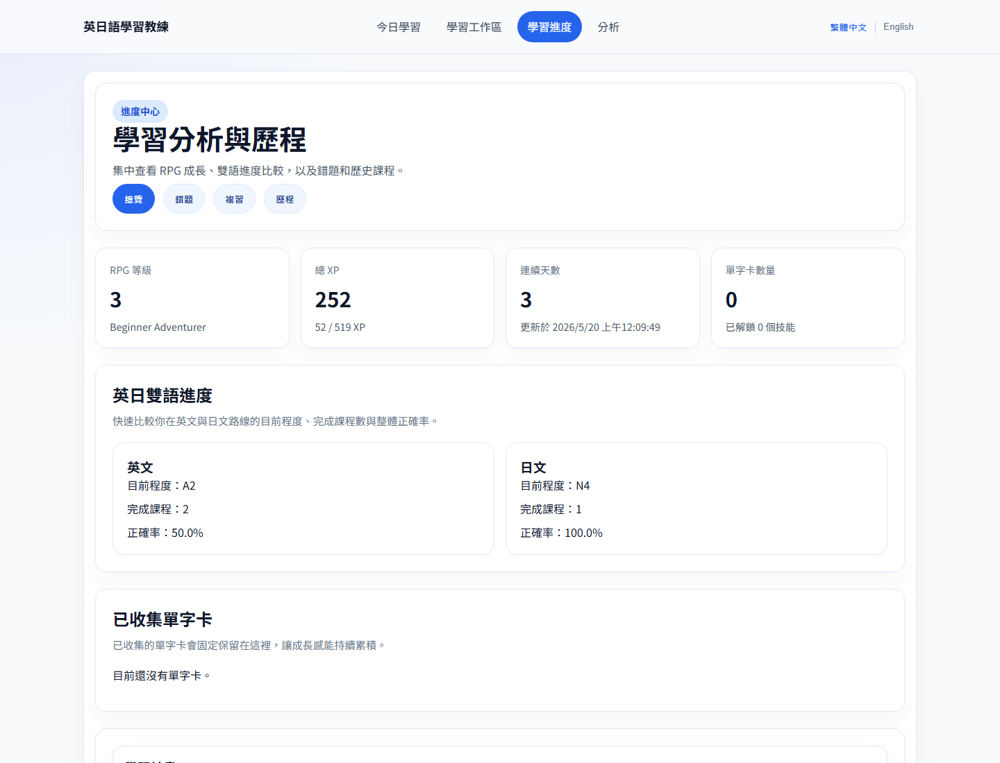
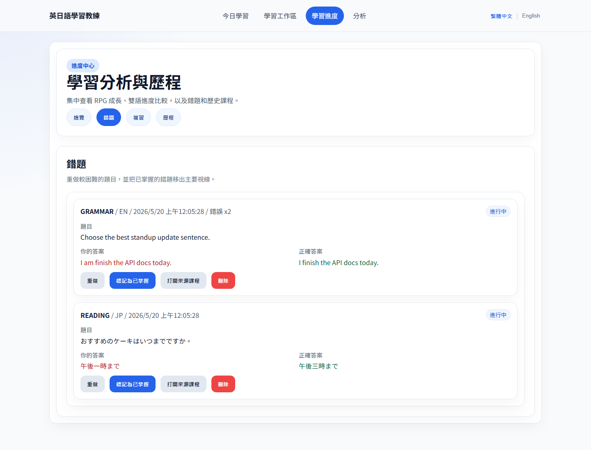
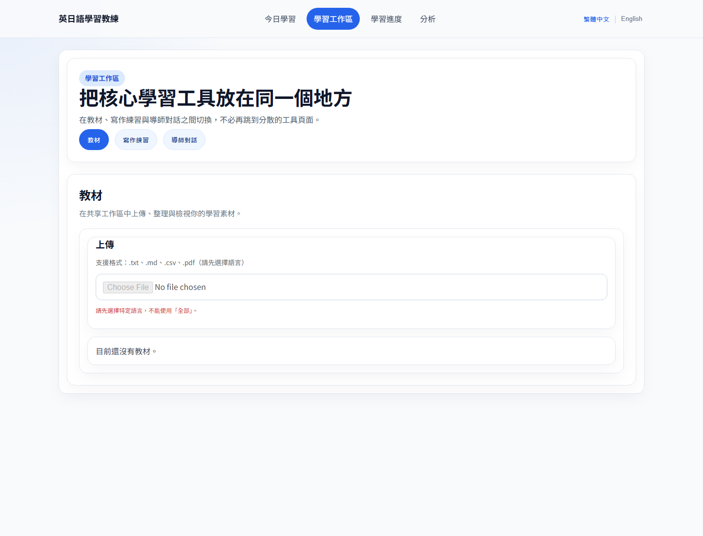
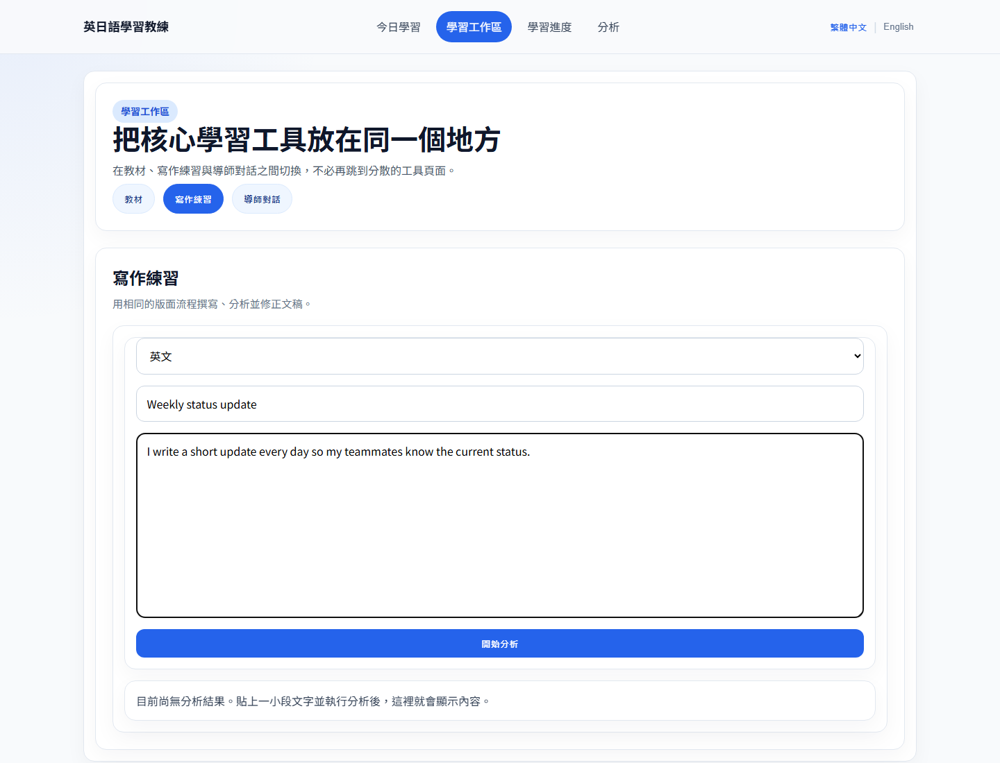

# English-Japanese Learning Coach

Portfolio-grade **AI English-Japanese Learning Coach** built with **FastAPI**, **Vue 3 + TypeScript**, **SQLite**, **spaced repetition**, **chunked RAG lesson evidence**, **wrong-answer review**, **progress analytics**, and **gamification**.

The project is designed for live demos: it can generate EN/JP lessons, score reviews, update learner progress, track wrong answers, export PDFs, and optionally reset demo data back to a presentable state in local demo environments.

<!-- release:current=v1.5.0-rc1 -->
Current release: `v1.5.0-rc1`.

This project currently runs as a single-user/local demo learning coach. It does not include production-grade authentication, authorization, user isolation, rate limiting, or audit logging by default.

TTS is integration-ready but disabled by default. No real TTS provider is enabled unless configured; `POST /api/tts` returns `available=false` with an explicit message unless a real runtime provider is configured.

## Local Demo Security Boundary

This repository is intentionally scoped as a local-first demo and portfolio project. Authentication, authorization, user isolation, rate limiting, and audit logging are out of scope for this release line; do not expose the demo API or SQLite data directory as a production multi-user service without adding those controls first.

## Highlights

- FastAPI backend with typed APIs for lessons, review, analytics, imports, demo reset, and tutor tools
- Vue 3 + TypeScript frontend with i18n, workspace flows, progress dashboards, wrong-answer review, and writing support
- Textbook-style AI lesson units with objectives, vocabulary, word roots, sentence patterns, grammar, dialogue, reading, text shadowing, Feynman prompts, and review plans
- Imported vocabulary categories, tags, roots, affixes, word families, and memory tips for stronger word-book review
- Optional RAG integration via ChromaDB, with chunked material storage plus safe disabled mode for CI and lightweight demos
- SRS and gamification flows that avoid duplicate XP on repeated submissions
- TTS provider-ready placeholder with a stable unavailable response shape; this is not shipped as full voice synthesis
- SQLite persistence with migration smoke tests and index coverage
- Dockerized backend with persistent `/data` volume and non-root runtime

## Portfolio Pitch

- Product-style learner dashboard instead of isolated API demo pages
- Stable standard test lane plus isolated optional RAG lane
- Full-stack demo path that does not depend on a live LLM
- Clear separation between health, readiness, local demo reset, and release packaging

## Architecture



Text architecture: the Vue frontend talks to the FastAPI backend through typed REST clients. FastAPI persists progress, lessons, SRS, wrong answers, imported vocabulary categories, activity streaks, and analytics in SQLite. Core mode works without RAG dependencies. RAG mode requires `backend/requirements-rag.txt`, `ENABLE_RAG=true`, and separate verification; when enabled it stores chunked material metadata in ChromaDB. TTS is integration-ready and currently returns an explicit preview/unavailable contract until a real provider is configured.

## Textbook-Style Lessons

Generated EN/JP lessons are structured like a compact textbook unit. A lesson keeps the legacy `vocabulary`, `grammar`, `reading`, and `dialogue` fields for API/UI compatibility, and adds objectives, word roots or affixes, sentence patterns, text-based immersion shadowing, a Feynman self-explanation prompt, and a spaced review plan.

Vocabulary items can now carry part of speech, root, prefix, suffix, word family, memory tip, category, and tags. Excel imports accept these optional columns, and SRS due cards surface category, root, and memory tips so review can become more targeted without a risky SRS schema rewrite.

Immersion is currently text shadowing only. The TTS endpoint remains provider-ready but disabled by default until a real voice provider is configured.

## v1.5.0-rc1 Release Candidate

Version `1.5.0-rc1` is the first persisted-chat release candidate. It keeps the released `v1.4.3` adaptive-learning baseline intact while completing the learner-facing persisted conversation workflow:

- Persisted chat now includes typed REST scenario/conversation APIs, canonical persisted WebSocket events, scenario-aware conversation storage, and frontend conversation/history restoration across reloads.
- Persisted summaries now track a validated `summary_through_sequence` checkpoint and `summary_updated_at` timestamp, with canonical trigger recovery captured by migrations `0009` and `0010`.
- Scenario continuity now persists through migration `0011` so existing Travel, Restaurant, Workplace, and Daily Conversation chats reconnect without silent scenario replacement.
- Release packaging and archive verification still enforce the stricter secret, nested-archive, and virtual-environment checks from the `v1.4.3` release line.

Current limitations remain explicit:

- This remains a local single-user demonstration build, not a production multi-user SaaS deployment.
- Local single-process turn serialization is preserved; there is no distributed locking layer.
- Automatic rolling-summary generation is still out of scope.
- TTS is provider-ready but disabled by default unless a real provider is configured.
- Immersion is currently text shadowing rather than live audio coaching.
- Real recording and speech comparison are not part of this release.

The adaptive study flow remains:

- Daily Study Mission is available at `GET /api/study/today` and combines diagnostic status, due SRS counts, weak item counts, a suggested next lesson, and a completion summary.
- The Today Mission Panel surfaces that mission on the Today page so demos can start with one clear adaptive goal.
- Adaptive weak item review groups vocabulary, grammar, and sentence patterns so learners can repair the exact items that are blocking progress.
- The micro lesson template bank provides deterministic daily beginner lessons without requiring a live LLM.
- Correct micro-lesson completion and completion rewards commit in one database transaction; upgraded legacy completed lessons that predate reward events remain reward-read-only so missing event rows cannot grant duplicate XP.
- Analytics 2.0 exposes mastery state counts, weakest vocabulary / grammar / sentence patterns, and recent 7-day learning item review activity.
- Per-item SRS now tracks vocabulary, grammar, and sentence patterns through additive item-level endpoints, while the legacy lesson-wide and vocabulary-only paths remain available for backward compatibility.
- Snowball lesson generation can reuse a small amount of weak and recent items so future lessons feel connected instead of isolated.
- Feynman feedback now accepts a learner explanation and returns structured AI feedback when a provider is available, with a deterministic fallback when it is not.

Current limitations remain explicit:

- TTS is provider-ready but disabled by default unless a real provider is configured.
- Immersion is currently text shadowing rather than live audio coaching.
- RAG is optional and requires `backend/requirements-rag.txt` plus extra verification.
- Real recording and speech comparison are not part of this release.

## Portfolio Demo Flow

Use this path for the cleanest portfolio walkthrough:

1. Install backend dependencies with `cd backend && python -m pip install -r requirements-dev.lock.txt`.
2. Install frontend dependencies with `cd frontend && npm ci`.
3. Copy `backend/.env.example` to `backend/.env`.
4. In VS Code, choose `F5: Backend + Frontend` and press F5.
5. If `ALLOW_DEMO_RESET=true`, call `POST /api/demo/reset` to rebuild deterministic v1.4.3 demo data before presenting.
6. Open `Today` and show the Today Mission Panel: Daily Mission, micro lesson status, due SRS counts, weak item counts, and suggested next lesson.
7. Complete or inspect the seeded micro lesson from the template bank.
8. Open SRS due review and point out weak vocabulary, grammar, and sentence pattern items.
9. Open Analytics and show mastery states, weakest vocabulary / grammar / sentence patterns, and recent 7-day review activity.
10. Generate a lesson from `Today` and show the objectives, vocabulary, word roots, sentence patterns, grammar, dialogue, reading, immersion shadowing, Feynman prompt, and review plan sections.
11. Submit one review and show the progress update.
12. Generate another lesson and explain that weak/recent items can reappear through snowball context.
13. Submit a Feynman explanation and show the structured feedback or deterministic fallback feedback.
14. Import a vocabulary Excel file that includes `root`, `category`, and `tags`.
15. Search the vocabulary page by `root`, `category`, or `tags`.
16. Export the lesson as PDF.

## 30-second Demo Flow

1. If you are running a local demo, start the backend with `ALLOW_DEMO_RESET=true` and reset demo data with `POST /api/demo/reset`.
2. Generate or open today's lesson.
3. Complete one review submission.
4. Check progress.
5. Export PDF.
6. Try materials / RAG if enabled.

## Demo Flow

1. Open `Today` and generate an English or Japanese lesson.
2. Complete grammar and reading questions.
3. Submit review results to update progress, SRS, and wrong-answer records.
4. Show `Progress`, `Vocabulary`, `Wrong Answers`, `Analytics`, `Workspace`, and `Writing Center`.

Reset demo data at any time:

```bash
ALLOW_DEMO_RESET=true python -m uvicorn main:app --reload --host 0.0.0.0 --port 8000
curl -X POST http://127.0.0.1:8000/api/demo/reset
```

## Repository Layout

- `backend/` FastAPI application, database layer, lesson generation, tests, Docker image
- `frontend/` Vue 3 application, i18n resources, service client, Vitest and Playwright tests
- `docs/screenshots/` suggested portfolio screenshots
- `data/` runtime data directory kept in git only as `data/.gitkeep`
- `LICENSE` project license

## Environment

Backend environment variables:

- `DATA_DIR` runtime data directory
- `DB_PATH` SQLite database path
- `CHROMA_DB_PATH` Chroma persistence directory
- `ENABLE_RAG` defaults to `false`; set `true` only after installing `backend/requirements-rag.txt`
- `ALLOW_DEMO_RESET` defaults to `false`; set `true` only for local demo or seeded full-stack test runs
- `MAX_UPLOAD_SIZE_MB` maximum upload size for import and RAG material endpoints, defaults to `10`
- `CORS_ORIGINS` comma-separated frontend origins
- `LOG_LEVEL` backend log level

Frontend environment variables:

- `VITE_API_BASE_URL` defaults to `/api`, so local development uses the Vite proxy in `frontend/vite.config.ts`
- `VITE_WS_BASE_URL` is optional; when omitted, the app derives the WebSocket origin from `VITE_API_BASE_URL` or the current browser host

Runtime requirements:

- Release verification is pinned to `Python 3.11.x`.
- Frontend tooling and CI are pinned to `Node.js 22.18.0` via `.nvmrc`, `.node-version`, `frontend/package.json`, and GitHub Actions.

Use `backend/.env.example` as the source of truth for local configuration. Do not commit real secrets or provider credentials. For local development, RAG is disabled by default. Enable it only after installing `backend/requirements-rag.txt` and setting `ENABLE_RAG=true`.

Runtime data such as local SQLite files, generated lessons, audio, exports, and Chroma persistence must stay out of git. The repository keeps only `data/.gitkeep`; create runtime content locally under `data/` or a custom `DATA_DIR`.

Versioning uses root `VERSION` as the source of truth. Backend app metadata and release archives read that file, and `scripts/verify_delivery.py` checks that `frontend/package.json` stays in sync.

## Local Setup

### Backend

```bash
cd backend
python -m venv .venv
# Windows: .venv\Scripts\activate
# macOS/Linux: source .venv/bin/activate
python -m pip install -U pip
python -m pip install -r requirements-dev.lock.txt
# Optional: install RAG dependencies only when you want ENABLE_RAG=true
# python -m pip install -r requirements-rag.lock.txt
# Windows: copy .env.example .env
# macOS/Linux: cp .env.example .env
python -m uvicorn main:app --reload --host 0.0.0.0 --port 8000
```

### Frontend

```bash
nvm install
nvm use
node -v   # should print 22.18.0
cd frontend
npm ci
npm run dev
```

Then open [http://localhost:5173](http://localhost:5173).

## VS Code F5 One-Click Development

This repository includes a VS Code launch configuration for starting the frontend Vite development server and the backend FastAPI app together with a single F5 press.

1. Open the project root in VS Code.
2. Ensure your Python interpreter is set to the virtual environment or Python installation used for this project.
3. Copy `backend/.env.example` to `backend/.env` if you do not already have `backend/.env`.
4. Select the `F5: Backend + Frontend` configuration in the Run and Debug panel.
5. Press F5.

What happens:

- VS Code runs the `Frontend Dev Server` background task in `frontend/`.
- Vite starts and listens on the default port (`http://localhost:5173`).
- VS Code launches the backend using `python -m uvicorn main:app --reload --host 0.0.0.0 --port 8000` from `backend/`.
- The backend is debug-ready and supports breakpoints through the Python extension.

If you want only the backend debug session, choose `F5: Backend Only`.

### Troubleshooting

- Confirm the Python interpreter in VS Code is correct and can import backend dependencies.
- Confirm `backend/.env` exists by copying `backend/.env.example`.
- Run `cd backend && python -m pip install -r requirements-dev.lock.txt` if dependencies are missing.
- Run `cd frontend && npm ci` if `node_modules` is missing or outdated.
- Check ports `8000` and `5173` are not already in use.

## Docker

The provided Compose file starts the backend API only. The frontend is intended to run with `npm run dev` on the host during development.

```bash
docker compose up --build
```

The API is exposed at [http://localhost:8000](http://localhost:8000). Liveness is available at [http://localhost:8000/api/health](http://localhost:8000/api/health) and checks only app + DB basics. Readiness is available at [http://localhost:8000/api/ready](http://localhost:8000/api/ready) and reports Ollama/RAG status. The compose configuration defaults `ENABLE_RAG=false` plus `MAX_UPLOAD_SIZE_MB=10` for reliable startup in environments without ChromaDB.

The backend image installs `fonts-noto-cjk` and `fontconfig` so PDF export can render Japanese and Chinese text reliably. The PDF exporter prefers an installed CJK font and logs a warning before falling back to Helvetica if no compatible font is available. For local Windows development, the exporter checks common system CJK fonts such as Microsoft YaHei, Microsoft JhengHei, MingLiU, SimSun, MS Gothic, and Yu Gothic. Set `PDF_CJK_FONT_PATH=C:\Windows\Fonts\msjh.ttc` or another known CJK font path if your machine uses a nonstandard font install.

## Testing

### Backend

Standard backend checks:

```bash
python scripts/python_dependency_locks.py check
python -m compileall backend scripts tests
python -m ruff check backend scripts tests
python -m mypy backend
python -m pytest -q -m "not rag and not startup_isolation"
python -m pytest backend/tests/test_rag_disabled_startup.py -q
python -m pytest -q -m "not rag and not startup_isolation" --cov=backend --cov-branch --cov-report=term-missing:skip-covered --cov-report=xml:coverage/backend/coverage.xml --cov-report=json:coverage/backend/coverage.json --cov-report=html:coverage/backend/html -W error::ResourceWarning
```

Optional RAG smoke check:

```bash
cd backend
python -m pip install -r requirements-rag.lock.txt
python -m pytest tests -q -m rag
```

Test lanes at a glance:

- Standard backend/frontend checks are the default CI-safe gate and do not require ChromaDB or Ollama.
- Optional RAG tests validate Chroma-backed flows only after installing `backend/requirements-rag.txt`.
- Mocked Playwright E2E validates the primary lesson flow with deterministic API mocks.
- Full-stack smoke E2E validates the seeded real backend/frontend path without a live LLM.

### Frontend

```bash
cd frontend
npm ci
npm audit --omit=dev
npm audit
npm run typecheck
npm run lint
npm run format:check
npm run test:unit
npm run test:component
npm run build
```

### Mocked Frontend E2E

```bash
cd frontend
npm ci
npm run e2e:install
RUN_E2E=1 npm run test:e2e -- --project=chromium
```

On Windows, `npm run e2e:install` runs `playwright install chromium`. If the npm script is unavailable, run `cd frontend && npx playwright install chromium` after `npm ci`.

Playwright mocked E2E starts only the Vite dev server and mocks lesson, review, progress, analytics, streak, onboarding, and PDF export APIs inside the test run.

- No backend startup is required for `cd frontend && npm run test:e2e -- --project=chromium`
- No Ollama, ChromaDB, network access, or other external services are required
- The E2E lesson flow uses stable mocked lesson/review responses instead of relying on live generation

### Full-Stack E2E

```bash
cd backend
python -m pip install -r requirements.txt -r requirements-dev.txt
```

```bash
cd frontend
npm ci
npm run e2e:install
npm run test:e2e:fullstack -- --project=chromium
```

The full-stack Playwright suite starts:

- a real FastAPI backend on `http://127.0.0.1:8000`
- a real Vite frontend on `http://127.0.0.1:4273`

It uses `POST /api/demo/reset` before and after the run to seed deterministic demo data, so the backend process for this suite must set `ALLOW_DEMO_RESET=true`. The suite still keeps `ENABLE_RAG=false` so it does not depend on ChromaDB.

## Demo Seed

For local demos only:

```bash
ALLOW_DEMO_RESET=true python -m uvicorn main:app --reload --host 0.0.0.0 --port 8000
curl -X POST http://127.0.0.1:8000/api/demo/reset
```

This reseeds a deterministic v1.4.3 demo lesson, progress snapshot, item-level SRS data, weak-item groups, 7-day review activity, and supporting demo data for the default user.

### Full-Stack Smoke E2E

```bash
cd backend
python -m pip install -r requirements.txt -r requirements-dev.txt
```

```bash
cd frontend
npm ci
npm run e2e:install
npm run test:e2e:fullstack:smoke -- --project=chromium
```

This smoke suite validates the shortest stable real-app path:

- backend starts and serves `/api/health`
- frontend starts and serves the app shell
- the frontend loads seeded lesson data from the backend
- seeded review submission updates progress

### CI E2E Policy

- `npm run test:e2e` is the default CI-safe acceptance check because it is API-mocked and deterministic.
- `npm run test:e2e:fullstack:smoke` now runs automatically in CI for pull requests, pushes to `main`/`master`, and the nightly scheduled workflow.
- `npm run test:e2e:fullstack` remains reserved for `workflow_dispatch` / manual verification because it boots both servers and exercises the broader persistence and PDF/wrong-answer flow.
- The full-stack smoke and full suite both avoid external AI-provider dependency by relying on deterministic demo data and the backend fallback lesson path.

### Docker

```bash
docker compose config
docker compose build
docker compose up
```

## Screenshots

Real demo screenshots are committed under `docs/screenshots/`:

- 
- 
- 
- 
- 
- 

See [docs/screenshots/README.md](docs/screenshots/README.md) for the recommended screenshot list and missing captures, and [docs/DEMO_GUIDE.md](docs/DEMO_GUIDE.md) for a walkthrough-friendly presenter flow.

## Portfolio Signals

This project is intended to demonstrate engineering quality rather than flashy feature breadth: typed API contracts, migration-safe SQLite persistence, deterministic review scoring, SRS, gamification idempotency, RAG chunking contracts, frontend state/error handling, mocked E2E coverage, dependency audits, Docker config validation, and CI quality gates.

## Reliability Notes

- Importing `backend/main.py` does not require `chromadb` or `sentence-transformers` when `ENABLE_RAG=false`.
- `backend/requirements-rag.txt` contains the optional Chroma / embedding dependencies for RAG-enabled environments.
- If `ENABLE_RAG=true` but `chromadb` or `sentence-transformers` is not installed, the app still starts and RAG endpoints return a clear service-unavailable error instead of crashing startup.
- `GET /api/health` is intentionally lightweight and does not depend on Ollama or RAG. Use `GET /api/ready` when you need optional dependency status.
- Upload endpoints enforce a `MAX_UPLOAD_SIZE_MB` limit with chunked reads and return HTTP `413` with code `FILE_TOO_LARGE` when exceeded.
- Excel import is intentionally `.xlsx` only. The backend uses `openpyxl`, and the frontend/file validation/docs now match that contract.
- RAG uploads support `.txt`, `.md`, `.csv`, and `.pdf`. Stored vectors are CJK-aware chunked per material and keep stable metadata for `material_id`, `title`, `language`, `source_type`, `chunk_index`, `total_chunks`, and `uploaded_at`.
- Re-submitted lesson reviews do not duplicate XP or completed lesson count; progress keeps the best per-lesson score while SRS reflects the latest attempt.
- Review submission requires a complete answer set for every grammar and reading question; incomplete, duplicate, or out-of-range answers now return a clear `422` error instead of silently counting missing answers as wrong.
- When `ENABLE_RAG=false`, `GET /api/rag/materials` still returns a stable empty list while mutating endpoints return a clear unavailable error.
- Playwright E2E is intentionally mocked at the API layer so CI does not depend on backend process startup, demo seed state, or real LLM/Ollama availability.
- The separate full-stack Playwright suite validates the real seed-reset and persistence path without making every PR wait on a two-process browser test.
- The full-stack smoke suite adds a shorter real-app connectivity check for every PR, push to `main`/`master`, and nightly run.
- Lesson generation can fall back to deterministic sample content when the model path fails.
- Analytics accuracy trend now exposes `latest_accuracy_rate` and `best_accuracy_rate` separately so repeated attempts do not blur current performance versus best historical score.
- Demo reset rebuilds stable sample data for portfolio walkthroughs.

## Troubleshooting

- Python version: use `3.11.x` for the same toolchain that CI and `scripts/verify_delivery.py` enforce.
- Node version: use `22.18.0`. The repo pins this in `.nvmrc`, `.node-version`, `frontend/package.json`, and GitHub Actions.
- Optional RAG dependency: install `backend/requirements-rag.txt` only when you want `ENABLE_RAG=true` or `python -m pytest backend/tests -q -m rag`.
- Ollama not running: standard tests and `/api/health` should still work; check `/api/ready` for optional dependency status.
- Frontend API base URL: `VITE_API_BASE_URL` controls REST calls, and WebSocket URLs are derived from the current host or API origin instead of hardcoded `localhost`.
- Playwright browser install: run `cd frontend && npm run e2e:install` before the first local E2E run if Chromium is missing.

## Release Delivery

Use the helper scripts when preparing a handoff build:

```bash
python scripts/verify_delivery.py
python scripts/verify_delivery.py --include-rag
python scripts/make_release_zip.py
```

`scripts/verify_delivery.py` is the standard release gate for a clean checkout. It enforces Python `3.11.x`, Node `22.18.0`, Python dependency locked-install verification, backend dependency availability, version consistency, backend compile/lint/type checks, the main backend pytest lane excluding `rag` and `startup_isolation`, the separate startup isolation pytest lane, backend application-only coverage reporting, `npm ci`, both frontend audits, frontend checks, frontend coverage generation, and release-zip validation. Use `--include-rag`, `--mode rag`, or `--mode full` only after installing `backend/requirements-rag.lock.txt`; those modes fail fast when the optional RAG dependency set is missing. `scripts/python_dependency_locks.py check` validates lock metadata fingerprints plus portability and secret-redaction rules without re-resolving the live package index during ordinary CI runs. `scripts/make_release_zip.py` and `scripts/release_file_policy.py` create a delivery zip under `dist/` while preserving only approved env templates (`.env.example`, `.env.sample`, `.env.template`) and excluding `.envrc`, every filename beginning with `.env` except those templates, every filename ending with `.env`, every filename containing `.env.` or `.env-`, stage-style `env.*` / `env-*` variants at any depth with case-insensitive matching, common credential files such as `.npmrc`, `.pypirc`, `.netrc`, `id_rsa`, `id_ed25519`, `service-account.json`, `.pem`, `.key`, `.p12`, and `.pfx`, plus local runtime directories such as `.direnv`, while still allowing source declaration files such as `frontend/src/env.d.ts`. Runtime DB/log artifacts, Chroma data, generated lessons/audio/exports, backup directories, local validation output directories such as `dist_phase1_check/`, `dist_test/`, and `dist-local/`, nested archives such as `.zip`, `.tar`, `.tar.gz`, and `.tgz`, frontend build output, test reports, caches, virtualenvs, `node_modules`, and other local build artifacts remain excluded as well. Release ZIP creation now writes through a temporary file and replaces the final archive atomically only after the build succeeds. Release extraction smoke also syntax-checks `start_backend.sh`, `start_frontend.sh`, and `backend/docker-entrypoint.sh` with `bash -n` on non-Windows hosts when `bash` is available.

SQLite maintenance commands:

```bash
python scripts/sqlite_backup_restore.py backup --target data/backups/language_coach-2026-07-17.sqlite3
python scripts/sqlite_backup_restore.py restore --source data/backups/language_coach-2026-07-17.sqlite3 --target data/language_coach.db --dry-run
python scripts/sqlite_backup_restore.py restore --source data/backups/language_coach-2026-07-17.sqlite3 --target data/language_coach.db --force
python scripts/sqlite_backup_restore.py validate --source data/backups/language_coach-2026-07-17.sqlite3
```

Stop the app before replacing an active SQLite file. Validation is read-only, but actual backup/restore replacement is intended for a stopped local instance.

Intentional Python lock refresh command:

```bash
python scripts/python_dependency_locks.py refresh
```

See [DEVELOPMENT.md](DEVELOPMENT.md) for pinned local setup steps, [TEST_PLAN.md](TEST_PLAN.md) for the reproducible validation command set, and [DEPLOYMENT.md](DEPLOYMENT.md) for Docker and PDF font deployment notes.

## License

MIT. See [LICENSE](LICENSE).
