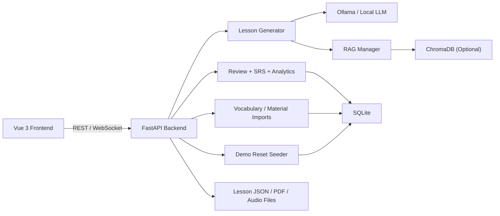

# English-Japanese Learning Coach

Portfolio-grade **AI English-Japanese Learning Coach** built with **FastAPI**, **Vue 3 + TypeScript**, **SQLite**, **spaced repetition**, **chunked RAG lesson evidence**, **wrong-answer review**, **progress analytics**, and **gamification**.

The project is designed for live demos: it can generate EN/JP lessons, score reviews, update learner progress, track wrong answers, export PDFs, and optionally reset demo data back to a presentable state in local demo environments.

TTS is currently integration-ready rather than provider-backed: `POST /api/tts` returns `available=false` with an explicit message unless a real runtime provider is configured.

## Highlights

- FastAPI backend with typed APIs for lessons, review, analytics, imports, demo reset, and tutor tools
- Vue 3 + TypeScript frontend with i18n, workspace flows, progress dashboards, wrong-answer review, and writing support
- Optional RAG integration via ChromaDB, with chunked material storage plus safe disabled mode for CI and lightweight demos
- SRS and gamification flows that avoid duplicate XP on repeated submissions
- TTS provider-ready placeholder with a stable unavailable response shape; this is not shipped as full voice synthesis
- SQLite persistence with migration smoke tests and index coverage
- Dockerized backend with persistent `/data` volume and non-root runtime

## Portfolio Pitch

- Product-style learner dashboard instead of isolated API demo pages
- Stable standard test lane plus isolated optional RAG lane
- Full-stack demo path that does not depend on a live LLM
- Clear separation between health, readiness, local demo reset, and release packaging

## Architecture



Text architecture: the Vue frontend talks to the FastAPI backend through typed REST clients. FastAPI persists progress, lessons, SRS, wrong answers, activity streaks, and analytics in SQLite. RAG is optional and disabled by default; when enabled it stores chunked material metadata in ChromaDB. TTS is integration-ready and currently returns an explicit preview/unavailable contract until a real provider is configured.

## 30-second Demo Flow

1. If you are running a local demo, start the backend with `ALLOW_DEMO_RESET=true` and reset demo data with `POST /api/demo/reset`.
2. Generate or open today’s lesson.
3. Complete one review submission.
4. Check progress.
5. Export PDF.
6. Try materials / RAG if enabled.

## Demo Flow

1. Open `Today` and generate an English or Japanese lesson.
2. Complete grammar and reading questions.
3. Submit review results to update progress, SRS, and wrong-answer records.
4. Show `Progress`, `Vocabulary`, `Wrong Answers`, `Analytics`, `Workspace`, and `Writing Center`.

Reset demo data at any time:

```bash
ALLOW_DEMO_RESET=true python -m uvicorn main:app --reload --host 0.0.0.0 --port 8000
curl -X POST http://127.0.0.1:8000/api/demo/reset
```

## Repository Layout

- `backend/` FastAPI application, database layer, lesson generation, tests, Docker image
- `frontend/` Vue 3 application, i18n resources, service client, Vitest and Playwright tests
- `docs/screenshots/` suggested portfolio screenshots
- `data/` runtime data directory kept in git only as `data/.gitkeep`
- `LICENSE` project license

## Environment

Backend environment variables:

- `DATA_DIR` runtime data directory
- `DB_PATH` SQLite database path
- `CHROMA_DB_PATH` Chroma persistence directory
- `ENABLE_RAG` defaults to `false`; set `true` only after installing `backend/requirements-rag.txt`
- `ALLOW_DEMO_RESET` defaults to `false`; set `true` only for local demo or seeded full-stack test runs
- `MAX_UPLOAD_SIZE_MB` maximum upload size for import and RAG material endpoints, defaults to `10`
- `CORS_ORIGINS` comma-separated frontend origins
- `LOG_LEVEL` backend log level

Frontend environment variables:

- `VITE_API_BASE_URL` defaults to `/api`, so local development uses the Vite proxy in `frontend/vite.config.ts`
- `VITE_WS_BASE_URL` is optional; when omitted, the app derives the WebSocket origin from `VITE_API_BASE_URL` or the current browser host

Runtime requirements:

- Frontend tooling requires `Node.js 22.18.0+` because the current Vite/Vitest dependency tree includes packages that no longer support Node 20.

Use `backend/.env.example` as the source of truth for local configuration. Do not commit real secrets or provider credentials. For local development, RAG is disabled by default. Enable it only after installing `backend/requirements-rag.txt` and setting `ENABLE_RAG=true`.

Runtime data such as local SQLite files, generated lessons, audio, exports, and Chroma persistence must stay out of git. The repository keeps only `data/.gitkeep`; create runtime content locally under `data/` or a custom `DATA_DIR`.

## Local Setup

### Backend

```bash
cd backend
python -m venv .venv
# Windows: .venv\Scripts\activate
# macOS/Linux: source .venv/bin/activate
python -m pip install -U pip
python -m pip install -r requirements.txt -r requirements-dev.txt
# Optional: install RAG dependencies only when you want ENABLE_RAG=true
# python -m pip install -r requirements-rag.txt
# Windows: copy .env.example .env
# macOS/Linux: cp .env.example .env
python -m uvicorn main:app --reload --host 0.0.0.0 --port 8000
```

### Frontend

```bash
cd frontend
node -v   # should be 22.18.0 or newer
nvm use   # optional, uses the repo-pinned 22.18.0 from .nvmrc / .node-version
npm ci
npm run dev
```

Then open [http://localhost:5173](http://localhost:5173).

## Docker

The provided Compose file starts the backend API only. The frontend is intended to run with `npm run dev` on the host during development.

```bash
docker compose up --build
```

The API is exposed at [http://localhost:8000](http://localhost:8000). Liveness is available at [http://localhost:8000/api/health](http://localhost:8000/api/health) and checks only app + DB basics. Readiness is available at [http://localhost:8000/api/ready](http://localhost:8000/api/ready) and reports Ollama/RAG status. The compose configuration defaults `ENABLE_RAG=false` plus `MAX_UPLOAD_SIZE_MB=10` for reliable startup in environments without ChromaDB.

## Testing

### Backend

Standard backend checks:

```bash
python -m compileall -q backend
python -m ruff check backend tests
python -m mypy backend
python -m pytest backend/tests -q -m "not rag"
```

Optional RAG smoke check:

```bash
python -m pip install -r backend/requirements-rag.txt
python -m pytest backend/tests -q -m rag
```

Test lanes at a glance:

- Standard backend/frontend checks are the default CI-safe gate and do not require ChromaDB or Ollama.
- Optional RAG tests validate Chroma-backed flows only after installing `backend/requirements-rag.txt`.
- Mocked Playwright E2E validates the primary lesson flow with deterministic API mocks.
- Full-stack smoke E2E validates the seeded real backend/frontend path without a live LLM.

### Frontend

```bash
cd frontend
node -v   # should be 22.18.0 or newer
npm ci
npm audit
npm audit --omit=dev
npm run typecheck
npm run lint
npm run format:check
npm run test:ci
npm run build
```

### Mocked Frontend E2E

```bash
cd frontend
node -v   # should be 22.18.0 or newer
npm ci
npx playwright install --with-deps chromium
RUN_E2E=1 npm run test:e2e -- --project=chromium
```

Playwright mocked E2E starts only the Vite dev server and mocks lesson, review, progress, analytics, streak, onboarding, and PDF export APIs inside the test run.

- No backend startup is required for `cd frontend && npm run test:e2e -- --project=chromium`
- No Ollama, ChromaDB, network access, or other external services are required
- The E2E lesson flow uses stable mocked lesson/review responses instead of relying on live generation

### Full-Stack E2E

```bash
cd backend
python -m pip install -r requirements.txt -r requirements-dev.txt
```

```bash
cd frontend
node -v   # should be 22.18.0 or newer
npm ci
npx playwright install --with-deps chromium
npm run test:e2e:fullstack -- --project=chromium
```

The full-stack Playwright suite starts:

- a real FastAPI backend on `http://127.0.0.1:8000`
- a real Vite frontend on `http://127.0.0.1:4273`

It uses `POST /api/demo/reset` before and after the run to seed deterministic demo data, so the backend process for this suite must set `ALLOW_DEMO_RESET=true`. The suite still keeps `ENABLE_RAG=false` so it does not depend on ChromaDB.

## Demo Seed

For local demos only:

```bash
ALLOW_DEMO_RESET=true python -m uvicorn main:app --reload --host 0.0.0.0 --port 8000
curl -X POST http://127.0.0.1:8000/api/demo/reset
```

This reseeds a deterministic lesson, progress snapshot, wrong answers, and supporting demo data for the default user.

### Full-Stack Smoke E2E

```bash
cd backend
python -m pip install -r requirements.txt -r requirements-dev.txt
```

```bash
cd frontend
node -v   # should be 22.18.0 or newer
npm ci
npx playwright install --with-deps chromium
npm run test:e2e:fullstack:smoke -- --project=chromium
```

This smoke suite validates the shortest stable real-app path:

- backend starts and serves `/api/health`
- frontend starts and serves the app shell
- the frontend loads seeded lesson data from the backend
- seeded review submission updates progress

### CI E2E Policy

- `npm run test:e2e` is the default CI-safe acceptance check because it is API-mocked and deterministic.
- `npm run test:e2e:fullstack:smoke` now runs automatically in CI for pull requests, pushes to `main`/`master`, and the nightly scheduled workflow.
- `npm run test:e2e:fullstack` remains reserved for `workflow_dispatch` / manual verification because it boots both servers and exercises the broader persistence and PDF/wrong-answer flow.
- The full-stack smoke and full suite both avoid external AI-provider dependency by relying on deterministic demo data and the backend fallback lesson path.

### Docker

```bash
docker compose config
docker compose build
docker compose up
```

## Screenshots

Real demo screenshots are committed under `docs/screenshots/`:

- 
- 
- 
- 
- 
- 

See [docs/screenshots/README.md](docs/screenshots/README.md) for the recommended screenshot list and missing captures, and [docs/DEMO_GUIDE.md](docs/DEMO_GUIDE.md) for a walkthrough-friendly presenter flow.

## Portfolio Signals

This project is intended to demonstrate engineering quality rather than flashy feature breadth: typed API contracts, migration-safe SQLite persistence, deterministic review scoring, SRS, gamification idempotency, RAG chunking contracts, frontend state/error handling, mocked E2E coverage, dependency audits, Docker config validation, and CI quality gates.

## Reliability Notes

- Importing `backend/main.py` does not require `chromadb` or `sentence-transformers` when `ENABLE_RAG=false`.
- `backend/requirements-rag.txt` contains the optional Chroma / embedding dependencies for RAG-enabled environments.
- If `ENABLE_RAG=true` but `chromadb` or `sentence-transformers` is not installed, the app still starts and RAG endpoints return a clear service-unavailable error instead of crashing startup.
- `GET /api/health` is intentionally lightweight and does not depend on Ollama or RAG. Use `GET /api/ready` when you need optional dependency status.
- Upload endpoints enforce a `MAX_UPLOAD_SIZE_MB` limit with chunked reads and return HTTP `413` with code `FILE_TOO_LARGE` when exceeded.
- Excel import is intentionally `.xlsx` only. The backend uses `openpyxl`, and the frontend/file validation/docs now match that contract.
- RAG uploads support `.txt`, `.md`, `.csv`, and `.pdf`. Stored vectors are CJK-aware chunked per material and keep stable metadata for `material_id`, `title`, `language`, `source_type`, `chunk_index`, `total_chunks`, and `uploaded_at`.
- Re-submitted lesson reviews do not duplicate XP or completed lesson count; progress keeps the best per-lesson score while SRS reflects the latest attempt.
- When `ENABLE_RAG=false`, `GET /api/rag/materials` still returns a stable empty list while mutating endpoints return a clear unavailable error.
- Playwright E2E is intentionally mocked at the API layer so CI does not depend on backend process startup, demo seed state, or real LLM/Ollama availability.
- The separate full-stack Playwright suite validates the real seed-reset and persistence path without making every PR wait on a two-process browser test.
- The full-stack smoke suite adds a shorter real-app connectivity check for every PR, push to `main`/`master`, and nightly run.
- Lesson generation can fall back to deterministic sample content when the model path fails.
- Demo reset rebuilds stable sample data for portfolio walkthroughs.

## Troubleshooting

- Node version: use `22.18.0+`. The repo also pins this in `.nvmrc` and `.node-version`.
- Optional RAG dependency: install `backend/requirements-rag.txt` only when you want `ENABLE_RAG=true` or `python -m pytest backend/tests -q -m rag`.
- Ollama not running: standard tests and `/api/health` should still work; check `/api/ready` for optional dependency status.
- Frontend API base URL: `VITE_API_BASE_URL` controls REST calls, and WebSocket URLs are derived from the current host or API origin instead of hardcoded `localhost`.
- Playwright browser install: run `npx playwright install --with-deps chromium` before E2E if browsers are missing.

## Release Delivery

Use the helper scripts when preparing a handoff build:

```bash
python scripts/verify_delivery.py
python scripts/verify_delivery.py --include-rag
python scripts/make_release_zip.py
```

`scripts/verify_delivery.py` defaults to the standard release gate and excludes optional RAG tests. Use `--include-rag`, `--mode rag`, or `--mode full` only after installing `backend/requirements-rag.txt`. `scripts/make_release_zip.py` creates a delivery zip under `dist/` while excluding runtime DBs, Chroma data, generated lessons/audio/exports, test reports, caches, virtualenvs, `node_modules`, and other local build artifacts.

## License

MIT. See [LICENSE](LICENSE).
