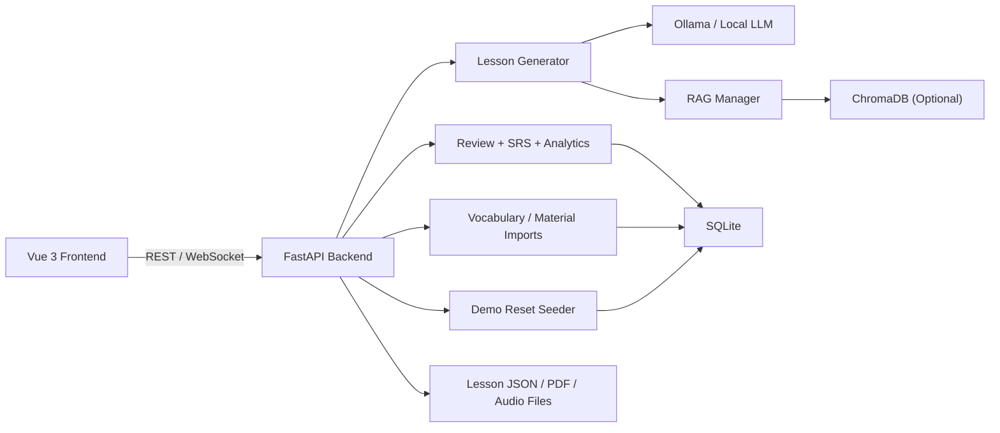

# English-Japanese Learning Coach

Portfolio-grade language learning demo built with **FastAPI**, **Vue 3**, **SQLite**, **spaced repetition**, **RAG-ready lesson generation**, and **WebSocket chat**.

The project is designed for live demos: it can generate EN/JP lessons, score reviews, update learner progress, track wrong answers, export PDFs, and reset demo data back to a presentable state.

## Highlights

- FastAPI backend with typed APIs for lessons, review, analytics, imports, demo reset, and tutor tools
- Vue 3 frontend with i18n, workspace flows, progress dashboards, wrong-answer review, and writing support
- Optional RAG integration via ChromaDB, with safe disabled mode for CI, smoke tests, and lightweight demos
- SQLite persistence with migration smoke tests and index coverage
- Dockerized backend with persistent `/data` volume and non-root runtime

## Architecture



## Demo Flow

1. Open `Today` and generate an English or Japanese lesson.
2. Complete grammar and reading questions.
3. Submit review results to update progress, SRS, and wrong-answer records.
4. Show `Progress`, `Vocabulary`, `Wrong Answers`, `Analytics`, `Workspace`, and `Writing Center`.

Reset demo data at any time:

```bash
curl -X POST http://127.0.0.1:8000/api/demo/reset
```

## Repository Layout

- `backend/` FastAPI application, database layer, lesson generation, tests, Docker image
- `frontend/` Vue 3 application, i18n resources, service client, Vitest and Playwright tests
- `docs/screenshots/` suggested portfolio screenshots
- `data/` runtime data directory kept in git only as `data/.gitkeep`
- `LICENSE` project license

## Environment

Backend environment variables:

- `DATA_DIR` runtime data directory
- `DB_PATH` SQLite database path
- `CHROMA_DB_PATH` Chroma persistence directory
- `ENABLE_RAG` set `true` to enable Chroma-backed RAG, `false` to disable it cleanly
- `CORS_ORIGINS` comma-separated frontend origins
- `LOG_LEVEL` backend log level

Frontend environment variables:

- `VITE_API_BASE_URL` defaults to `http://localhost:8000/api`
- `VITE_WS_BASE_URL` defaults to `ws://localhost:8000`

For local development, `ENABLE_RAG=false` is the safest default unless Chroma dependencies are intentionally installed and configured.

## Local Setup

### Backend

```bash
cd backend
python -m venv .venv
# Windows: .venv\Scripts\activate
# macOS/Linux: source .venv/bin/activate
python -m pip install -U pip
python -m pip install -r requirements.txt -r requirements-dev.txt
# Optional: install RAG dependencies when you want ENABLE_RAG=true
# python -m pip install -r requirements-rag.txt
# Windows: copy .env.example .env
# macOS/Linux: cp .env.example .env
python -m uvicorn main:app --reload --host 0.0.0.0 --port 8000
```

### Frontend

```bash
cd frontend
npm install
npm run dev
```

Then open [http://localhost:5173](http://localhost:5173).

## Docker

The provided Compose file starts the backend API only. The frontend is intended to run with `npm run dev` on the host during development.

```bash
docker compose up --build
```

The API is exposed at [http://localhost:8000](http://localhost:8000), and the compose configuration defaults `ENABLE_RAG=false` for reliable startup in environments without ChromaDB.

## Testing

### Backend

```bash
cd backend
python -m compileall -q .
ENABLE_RAG=false python -m pytest tests -q
```

### Frontend

```bash
cd frontend
npm install
npm run build
npm run test
```

### Docker

```bash
docker compose config
docker compose build
docker compose up
```

## Reliability Notes

- Importing `backend/main.py` does not require `chromadb` when `ENABLE_RAG=false`.
- `backend/requirements-rag.txt` contains the optional Chroma / embedding dependencies for RAG-enabled environments.
- If `ENABLE_RAG=true` but `chromadb` is not installed, the app still starts and RAG endpoints return a clear service-unavailable error instead of crashing startup.
- Lesson generation can fall back to deterministic sample content when the model path fails.
- Demo reset rebuilds stable sample data for portfolio walkthroughs.

## License

MIT. See [LICENSE](LICENSE).
