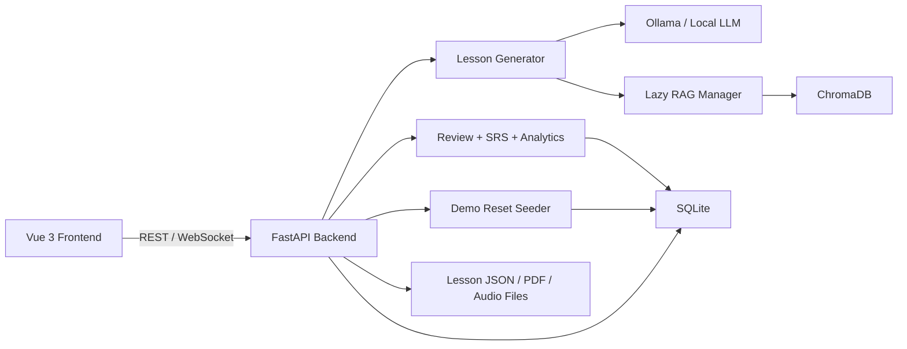

# English-Japanese Learning Coach

Portfolio-grade language learning demo built with **FastAPI**, **Vue 3**, **SQLite**, **RAG**, **spaced repetition**, and **WebSocket chat**.

In under 30 seconds: this app generates daily EN/JP lessons, scores reviews, updates progress and SRS schedules, tracks mistakes, and exposes a resettable demo dataset so the product is always ready for presentation.

## Technical Highlights

- FastAPI backend with typed lesson, review, analytics, and demo-reset APIs
- Vue 3 frontend with loading, empty, error, and retry states across core flows
- Lazy RAG initialization with `ENABLE_RAG=true|false` for CI-safe startup
- SQLite persistence with idempotent migrations and critical index backfills
- Spaced repetition review flow and wrong-answer notebook
- WebSocket chat preview for tutor-style conversation
- Dockerized backend with writable `/data` volume and non-root runtime

## Architecture



## Demo Flow

1. **Generate Lesson**  
   Open `Today`, choose English or Japanese, optionally add a topic, and generate a lesson.
2. **Answer Questions**  
   Complete grammar and reading questions in the lesson page.
3. **Review Mistakes**  
   Submit the review to score answers, update progress, and populate the Wrong Answer Notebook.
4. **View Analytics**  
   Open `Progress`, `Vocabulary`, `Mistakes`, and `Analytics` to show retention and learning signals.

For a clean presentation state at any time:

```bash
curl -X POST http://127.0.0.1:8000/api/demo/reset
```

## Screenshot Section

Use these four screens as the core portfolio walkthrough:

| Screen | What it demonstrates |
| --- | --- |
| `Today` | lesson generation, review flow, demo reset, and PDF export |
| `Vocabulary` | imported word bank, deletion consistency, and empty-state UX |
| `Progress` | RPG stats, word cards, and study-plan generation |
| `Chat` | WebSocket tutor preview and resilient reconnect handling |

Suggested capture targets live in [docs/screenshots](/C:/Users/whois/OneDrive/文件/GitHub/English-Japanese-Learning-Coach-Project-Requirements/docs/screenshots).

## Demo Mode and Data Model

- This repo is intentionally **single-tenant demo mode** and uses `default_user`.
- Frontend clients do **not** send arbitrary `user_id`.
- The backend enforces demo scoping while keeping the schema migration-ready for future auth.
- Lesson file paths are stored as relative keys under `DATA_DIR`, not machine-specific absolute paths.

## Environment Toggles

Backend environment variables:

- `DATA_DIR` - base runtime data directory
- `DB_PATH` - SQLite file path
- `CHROMA_DB_PATH` - Chroma persistence directory
- `ENABLE_RAG` - `true` to use ChromaDB lazily, `false` to use a dummy retriever
- `LOG_LEVEL` - default `INFO`
- `CORS_ORIGINS` - comma-separated frontend origins

`ENABLE_RAG=false` is the recommended setting for CI, smoke tests, and lightweight demos where embeddings are unnecessary.

## Local Quick Start

### Backend

```bash
cd backend
python -m venv .venv
# Windows: .venv\Scripts\activate
# macOS/Linux: source .venv/bin/activate
python -m pip install -U pip
python -m pip install -r requirements.txt -r requirements-dev.txt
cp .env.example .env
python -m uvicorn main:app --reload --host 0.0.0.0 --port 8000
```

### Frontend

```bash
cd frontend
npm install
npm run dev
```

Then open [http://localhost:5173](http://localhost:5173).

## Docker

```bash
docker compose up --build
```

The compose stack mounts `/data`, creates the directory on startup, fixes ownership for `appuser`, and defaults `ENABLE_RAG=false` for reliable demo startup.

## Testing

### Backend

```bash
cd backend
python -m pip install -r requirements.txt -r requirements-dev.txt
ENABLE_RAG=false pytest tests -v
```

### Frontend

```bash
cd frontend
npm install
npm run test
npm run build
```

### Playwright

```bash
cd frontend
RUN_E2E=1 npm run e2e -- --project=chromium
```

Set `RUN_E2E=0` to skip browser e2e during quick local or CI passes.

## Reliability Notes

- RAG and ChromaDB are **lazy-loaded** and never initialized at module import time.
- Backend startup avoids model loading and stays fast even when Ollama is unavailable.
- Error responses are normalized with `error`, `message`, and `code` fields.
- Scheduler and cache paths use structured logging instead of `print`.
- `/api/demo/reset` rebuilds lessons, vocabulary, wrong answers, and progress for a stable presentation state.

## License

MIT. See [LICENSE](/C:/Users/whois/OneDrive/文件/GitHub/English-Japanese-Learning-Coach-Project-Requirements/LICENSE).
